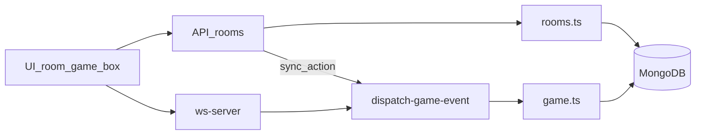
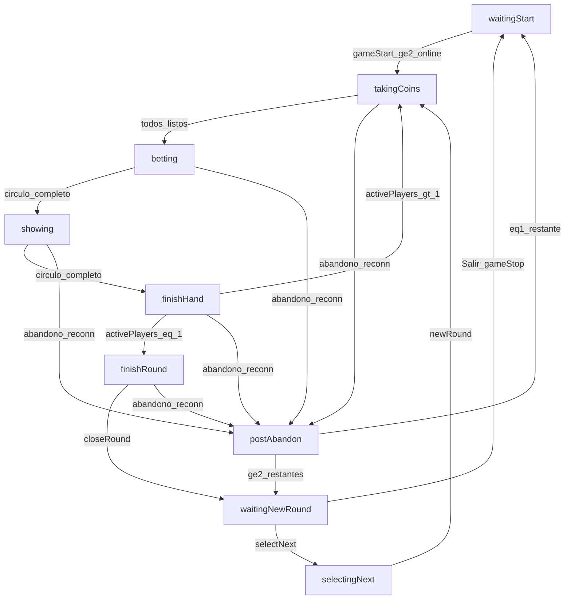
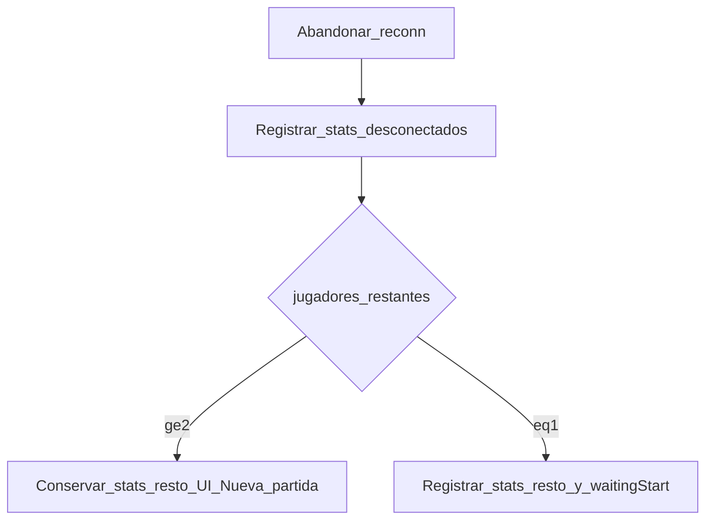

# Juego de Los Chinos — especificación de proceso

Documento de producto y técnica. Describe el **proceso de juego**, el **proceso de desarrollo** y las **reglas objetivo** (cambios pendientes de implementar). Sirve como referencia para revisar y modificar el código.

**Estado del documento**

| Ámbito | Estado |
|--------|--------|
| Flujo de fases de partida | Implementado (descripción = código actual) |
| Listados / join / Salir / reconexión / mid-join privada | Especificación **objetivo**; el código actual difiere (ver §9 y §10) |

**Decisiones de producto fijadas**

- **1B** — Entrada a sala privada con partida en curso: el jugador queda conectado en sala pero fuera de la mano; al llegar a `waitingNewRound` (o lobby) puede participar si alguien inicia *Nueva partida*.
- **2C** — Desconexión en `waitingNewRound`: 1 minuto sin reintentos y baja del jugador; si quedan ≥2 se mantiene la pantalla *Nueva partida* con las stats de la ronda ya jugada.

---

## 1. Visión y glosario

### 1.1 Visión

Aplicación multijugador en tiempo real del juego de los chinos: los jugadores ocultan monedas (0–3), apuestan el total, revelan y se van salvando hasta que queda un perdedor de ronda. Hay salas públicas y privadas, chat, y ranking persistente para usuarios registrados.

### 1.2 Roles

| Rol | Descripción |
|-----|-------------|
| **Propietario** | Creador de una sala privada (`owner`). Gestiona usuarios registrados en la sala y puede compartir enlace de invitado. |
| **Registrado en privada** | Usuario autenticado incluido en `room.users`. Ve la sala en su listado privado. |
| **Invitado / guest** | Entra a pública con nombre libre, o a privada vía enlace/contraseña. **No** tiene fila en `User`; sus partidas **no** van a ranking. |
| **Jugador en sala** | Presente en `game.players` (o cola de entrada mid-partida, §3.3). Puede estar online/offline. |
| **Jugador en mano** | Participa en la partida en curso (`inGamePlayers` / no `saved` según fase). Distinto de “en sala pero esperando fin de partida” (1B). |

### 1.3 Conceptos

| Término | Significado |
|---------|-------------|
| **Sala pública** | Visible en el listado público (con filtros del §3). Cualquiera puede unirse con nombre válido. |
| **Sala privada** | Visible solo a miembros registrados logueados. Acceso por membresía o invitado. |
| **Partida** | Desde `gameStart` hasta fin por `gameStop`, o hasta abandono por reconexión (con reglas de ranking del §7). Fases activas: de `takingCoins` a `finishRound` inclusive; `selectingNext` forma parte del ciclo de nueva ronda. |
| **Ronda** | Secuencia de manos hasta un único perdedor → `finishRound` → `waitingNewRound`. |
| **Mano** | Ciclo ocultar → apostar → mostrar → resolver ganador de mano. |
| **Ranking** | Persistencia en `User` + `Ranking` para usuarios registrados. Se escribe en `gameStop` y también en el abandono por reconexión mid-partida según §7 (stats ya acumuladas de rondas anteriores). |
| **Reconexión** | Recuperación tras pérdida de red (WS). Timers cliente y peers son independientes (§6). |

### 1.4 Estados

**`GameStatus`** (`src/types/enums.ts`)

| Valor | UI / significado |
|-------|------------------|
| `waitingStart` | Sala de espera (lobby). |
| `takingCoins` | Escondiendo monedas. |
| `betting` | Apostando (por turnos). |
| `showing` | Mostrando / revelando. |
| `finishHand` | Resultado de mano; continuar. |
| `finishRound` | Fin de ronda (perdedor); continuar. |
| `waitingNewRound` | ¿Jugar de nuevo? *Nueva partida* + *Salir*. |
| `selectingNext` | ¿Quién sale? (elige quien empieza la siguiente ronda). |

**`RoomStatus`** (enum actual vs semántica propuesta)

| Valor | Hoy en código | Semántica propuesta para listados |
|-------|---------------|-----------------------------------|
| `open` | Lobby / tras stop si &lt;5 | Sala acepta joins “completos” a la espera. |
| `closed` | 5 jugadores o tras `processStart` | Evitar uso ambiguo; preferir `full` / `playing`. |
| `playing` | **Nunca asignado** | Partida en curso (join público oculto; privada mid-join 1B). |
| `full` *(propuesto)* | — | 5 jugadores en sala; no más joins. |

**`RoomType`**: `public` | `private`.

---

## 2. Proceso de desarrollo del juego

### 2.1 Stack

- **Next.js** (App Router) + React — UI y API HTTP.
- **WebSocket** — `src/ws-server.ts` (ruta `/api/ws/game`), cookie HttpOnly `ws_chgame`.
- **MongoDB / Mongoose** — salas, usuarios, ranking.
- **i18n** — `next-intl`, ficheros `messages/{es,en,fr,it}.json`.
- **Cliente** — Zustand (`src/stores/room.ts`), hooks de socket y salida.

### 2.2 Capas

1. **HTTP salas** — crear, listar, unir, salir, cookie WS: [`src/lib/server/rooms.ts`](src/lib/server/rooms.ts) + rutas `src/app/api/rooms/**`.
2. **Eventos de juego** — [`dispatch-game-event.ts`](src/lib/server/dispatch-game-event.ts) → [`game.ts`](src/lib/server/game.ts).
3. **UI** — [`room-content.tsx`](src/components/game/room-content.tsx), [`game-box.tsx`](src/components/game/game-box.tsx), [`room-header.tsx`](src/components/game/room-header.tsx), listados en `src/components/rooms/**`.
4. **Hooks** — [`use-game-socket.ts`](src/hooks/use-game-socket.ts), [`use-room-exit-guard.ts`](src/hooks/use-room-exit-guard.ts).

### 2.3 Flujo de trabajo recomendado

1. Actualizar esta especificación (`juego.md`) si cambia el comportamiento.
2. Ajustar servidor (`rooms.ts` / `game.ts` / timers / join).
3. Ajustar UI + i18n.
4. Probar la matriz de aceptación (§8), en especial reconexión y mid-join privada.

### 2.4 Mapa de ficheros clave

| Fichero | Rol |
|---------|-----|
| `src/lib/server/rooms.ts` | Ciclo de vida HTTP de salas (create/list/join/leave). |
| `src/lib/server/game.ts` | Fases, sync, disconnect, stop/abandon, ranking. |
| `src/lib/server/dispatch-game-event.ts` | Mapa evento WS/HTTP → función de juego. |
| `src/lib/server/reconn-timer.ts` | Timers servidor de reconexión (hoy 10s × 5). |
| `src/ws-server.ts` | Servidor WS, heartbeat, broadcast. |
| `src/models/room.ts` | Esquema Room / Game / Player. |
| `src/types/enums.ts` | `GameStatus`, `RoomStatus`, `RoomType`. |
| `src/components/game/room-content.tsx` | Shell de sala, acciones, modales de salida. |
| `src/components/game/game-box.tsx` | UI por fase + pausa reconexión. |
| `src/components/game/room-header.tsx` | Jugar / Nueva partida / Salir. |
| `src/components/game/players-info.tsx` | Chips y punto online/offline. |
| `src/components/rooms/rooms-content.tsx` | Listados y create/join. |
| `src/hooks/use-game-socket.ts` | Cliente WS + reintentos + fallback HTTP. |
| `messages/*.json` | Textos UI y errores. |

### 2.5 Eventos de juego (dispatch)

| Evento | Handler |
|--------|---------|
| `sync` | `getSyncData` |
| `gameStart` | `processStart` |
| `coinsTaken` | `annotateCoins` |
| `betSetted` | `annotateBet` |
| `showCoins` | `showCoins` |
| `closeHand` | `closeHand` |
| `closeRound` | `closeRound` |
| `selectNext` | `selectNext` |
| `newRound` | `newRound` |
| `gameStop` | `gameStop` |
| `gameAbandon` | `gameAbandon` |
| `retryReconn` | `retryReconn` |
| `messageSent` | `annotateMsg` |

---

## 3. Ciclo de vida de salas (objetivo)

### 3.1 Crear

| Tipo | Requisitos | Efecto |
|------|------------|--------|
| Pública | Nombre de sala único; creador puede ser guest o logueado | `roomType: public`, `status: open`, `game.status: waitingStart`. El creador se une como jugador. |
| Privada | Usuario autenticado | `owner`, password, `users: [owner]`. |

Nombre de jugador: no puede impersonar un usuario registrado sin estar logueado como él.

### 3.2 Listados y unirse — público (objetivo)

En el listado de **salas públicas** solo aparecen salas que:

1. Están en **espera de iniciar** (`game.status === waitingStart`), y
2. Tienen **menos de 5 jugadores** en sala.

Solo esas permiten unirse. Salas en partida, llenas o cerradas **no** se listan (ni botón de unirse).

### 3.3 Listados y unirse — privado (objetivo)

- El usuario **logueado** y presente en `room.users` **siempre** ve la sala en su listado privado.
- **Unirse** solo si hay **&lt; 5** jugadores en sala.
- Si la sala tiene **partida en curso** (1B):
  - El jugador **entra a la sala** y figura **conectado** (`online: true`).
  - **No** entra en la mano en curso (no cuenta en turnos / `inGamePlayers` de esa partida). Implementación: flag tipo `pendingTable` / cola “en sala, no en mano”.
  - Cuando el juego pasa a **`waitingNewRound`** o **`waitingStart`**, deja de estar pendiente y pasa a **elegible** (misma lista que el resto para *Nueva partida* / *Jugar*).
  - En `waitingNewRound`, si alguien pulsa *Nueva partida*, el flujo `selectNext` / `newRound` **debe incluirlo** entre los jugadores de la siguiente ronda.
  - En lobby, *Jugar* (`processStart`) lo incluye si está online, igual que al resto.
- Si hay &lt; 5 y está en espera: join normal a la mano/lobby.

**Estado de implementación necesario:** flag o lista explícita “en sala pero no en mano” (hoy el join mid-game está bloqueado con `room_closed` / `game_in_play`).

### 3.4 Invitado a sala privada (objetivo)

- El **propietario** puede enviar un **enlace** a la sala privada para que otro usuario entre como **invitado**.
- El **nombre** del invitado debe ser distinto de **todos** los nombres en `room.users` (registrados en la sala), estén o no conectados.
- También debe respetar unicidad frente a jugadores ya presentes en `game.players`.
- Los datos de partidas del invitado **no** se persisten para ranking (no hay `User` asociado; `gameStop` ya hace `continue` si no hay usuario — elevar a regla de producto explícita).

### 3.5 Salir de la sala / capacidad

- Máximo **5** jugadores en sala.
- Sala pública vacía tras el último leave → se puede eliminar.
- En partida activa, *Salir* del header **no** se muestra (§5); la baja mid-partida solo por abandono de reconexión (§6).

### 3.6 Propietario — permisos

- Hoy: owner gestiona add/remove de `users`, edita/borra sala vía API admin.
- **No** se exige que solo el owner inicie o pare la partida (cualquier jugador con sesión WS válida puede emitir `gameStart` / `gameStop` / abandono según reglas UI).
- Este documento **no** introduce owner-gate de start/stop salvo que se decida después.

### 3.7 Contraste con el código actual

| Aspecto | Actual | Objetivo |
|---------|--------|----------|
| Listado público | Todas las públicas abiertas vía API; join deshabilitado si `status !== open` | Solo `waitingStart` y &lt;5 |
| Join mid-game | Bloqueado | Pública: no listar; privada: join 1B |
| `RoomStatus.playing` | No usado (`closed` al empezar) | Usar semántica clara para partida / lleno |
| Guest ranking | Omitido si no hay User | Regla explícita + validación nombre vs `users` |

---

## 4. Flujo de partida (fases)

### 4.1 Diagrama de transiciones

`postAbandon` = fin de la mano/partida en curso, baja de desconectados, ranking parcial según §7 (§6.3). No es el `gameAbandon` actual (que siempre vuelve a `waitingStart` y **borra** stats sin persistir).

### 4.2 Reglas por fase

| Fase | Quién actúa | UI principal |
|------|-------------|--------------|
| `waitingStart` | Cualquiera online (≥2 para *Jugar*) | Lobby; chips online; chat; *Jugar* / *Salir*. |
| `takingCoins` | Todos los activos (no `saved`) | Elegir 0–3 monedas; puño / ✓. |
| `betting` | `playerInTurn` | Apuesta única; badges de apuestas. |
| `showing` | `playerInTurn` | Revelar; monedas en tablero. |
| `finishHand` | Ganador de mano (continuar) | Total + mensaje; `closeHand`. |
| `finishRound` | Perdedor (continuar) | Mensaje de ronda; `closeRound`. |
| `waitingNewRound` | Cualquiera | *Nueva partida* → `selectNext`. *Salir* → `gameStop` (**con** ranking de las stats de sesión actuales). Tras abandono reconn con ≥2, las stats del resto **se conservan** en sesión (§7); un *Salir* posterior las registra. |
| `selectingNext` | Quien elige | Lista de nombres (“Tú”); `newRound` (incluye a elegibles 1B ya en sala). |

**Inicio (`processStart`)**: ≥2 jugadores **online**; los offline se descartan de la mesa; orden aleatorio; `room.status` pasa a no-abierto (hoy `closed`); `game.status = takingCoins`.

**Pausa**: mientras `gameInPause`, no se aceptan jugadas de monedas/apuesta/mostrar/mano/ronda/nueva ronda (`assertGameNotPaused`).

### 4.3 Campos de jugador (sesión)

| Campo | Uso |
|-------|-----|
| `name` | Identidad en sala (3–10 caracteres). |
| `online` | Conectado por WS. |
| `socketId` | Peer actual (evita cerrar sesión nueva por close viejo). |
| `saved` | Salvado en la ronda (ya no apuesta/oculta). |
| `coins` / `bet` / `lifted` | Estado de la mano. |
| `playedRounds`, `wonRounds`, `lostRounds`, `points` | Stats de sesión → ranking en `gameStop`. |

Campos de juego relevantes: `playerStart`, `playerInTurn`, `inGamePlayers`, `activePlayers`, `usersReconn`, `gameInPause`, `reconnFailed`, `reconnAttempt`.

### 4.4 Chat e indicadores

- Chat disponible en espera y en partida (`ChatBox`).
- Punto delante del nombre: verde si `online`, **gris** si offline (`PlayersInfo` + CSS `.chip-dot` / `.offline`).

---

## 5. Botón Salir (objetivo)

| Contexto | ¿Mostrar Salir? | Efecto |
|----------|-----------------|--------|
| `waitingStart` | Sí | Leave de sala (sin abandonar partida). |
| Partida activa: `takingCoins`, `betting`, `showing`, `finishHand`, `finishRound`, `selectingNext` | **No** | No hay salida voluntaria mid-partida por el header. |
| `waitingNewRound` (tras ronda normal) | Sí (+ *Nueva partida*) | `gameStop`: persiste ranking y vuelve a lobby. |
| `waitingNewRound` (tras abandono reconn, ≥2) | Sí (+ *Nueva partida*) | Stats del resto **conservadas**; *Salir* → `gameStop` registra esas stats; *Nueva partida* sigue acumulando sobre ellas. |

La única vía de “echar” jugadores o cortar la partida a mitad es el **abandono por reconexión fallida** (§6.3), no el botón *Salir*.

**Contraste actual:** el header muestra *Salir* también en fases activas y abre confirmación de abandono (`leaveRoom(abandon: true)` → `gameAbandon` + baja del que sale).

---

## 6. Reconexión (objetivo)

### 6.1 Detección

- El servidor detecta sockets muertos con **heartbeat** (hoy ping cada 10s sin pong → `terminate` → `disconnectUser`).
- El **cliente** debe detectar pérdida de conexión (cierre WS, errores de red, offline del navegador) y mostrar UX propia (§6.2), no solo reintentar en silencio.

### 6.2 Jugador que pierde la conexión

Aplicación en **espera** y **en juego**:

1. Detecta la pérdida.
2. Muestra un **pop-up** de reintento durante un tiempo largo (**600 s** por defecto).
3. El pop-up tiene botón **Abandonar**: deja de reintentar, se da de baja y se aplican las reglas de ranking del §7 para ese jugador (registrar stats de rondas anteriores si tiene `User`).
4. Si **reconecta** a tiempo: se restaura el estado previo (sync + cookie `ws_chgame`); desaparece el pop-up.
5. Timers del cliente (**600 s**) y de los peers (**60 s** por ventana) son **independientes**.

### 6.3 Resto de jugadores — dentro de una partida

Fases: `takingCoins` … `finishRound` y `selectingNext` (ciclo de juego / nueva ronda en curso). **No** incluye `waitingNewRound` ni `waitingStart` (esas van en §6.4).

1. El punto del jugador desconectado pasa a **gris**.
2. Pop-up: *Esperando reconexión de* + nombre(s) + icono de espera (semicírculo).
3. La partida queda en pausa (`gameInPause`).
4. Tras **1 minuto** sin recuperar a alguno de los desconectados:
   - Desaparece ese pop-up.
   - Aparece otro: no se consigue recuperar la conexión.
   - Botones: **Reintentar** (otra ventana de 1 minuto) y **Abandonar**.
5. **Abandonar**:
   - Corta la partida en curso (mano incompleta no cuenta como ronda cerrada).
   - Da de baja en la sala al jugador o jugadores **desconectados**.
   - **Ranking / stats** (detalle §7):
     - Jugador(es) que se dan de baja: se **registran** en ranking las stats ya acumuladas de **rondas anteriores** (campos de sesión `playedRounds` / `wonRounds` / `lostRounds` / `points`); invitados sin `User` se omiten.
     - Si quedan **≥ 2** → UI *Nueva partida* (`waitingNewRound`): las stats del **resto** se **conservan** en sesión (no se resetean; no se escriben aún en ranking). Elegibles 1B pasan a poder jugar. *Nueva partida* continúa la sesión; *Salir* hará `gameStop` con esas stats.
     - Si queda **1** → `waitingStart`: se **registran** en ranking las stats de ese jugador restante y se limpia la sesión de partida.

### 6.4 Resto de jugadores — sala de espera o `waitingNewRound` (2C)

Incluye `waitingStart` y `waitingNewRound`.

1. Punto gris + pop-up de espera de reconexión (igual texto/spinner).
2. **No** hay botón *Reintentar* ni segundo ciclo: un solo minuto.
3. Tras **1 minuto** sin recuperación:
   - Se da de baja al jugador desconectado de la sala y se **registran** sus stats de sesión ya acumuladas (si tiene `User`; §7).
   - En `waitingStart`: mostrar u ocultar *Jugar* según número de online/restantes (≥2).
   - En `waitingNewRound`: si quedan **≥ 2**, se mantiene la pantalla *Nueva partida* **conservando** las stats del resto; si queda 1, registrar las stats de ese restante y pasar a sala de espera.

### 6.5 Reconexión tardía tras baja

Si el cliente sigue reintentando (hasta 600 s) pero los peers ya abandonaron o dieron de baja al jugador:

- Al reconectar debe recibir un error coherente (`no_joined_room`, jugador no en sala, sala inexistente, etc.).
- No debe reinsertarse en una partida ya abandonada o en una plaza ya liberada sin un join nuevo explícito.

### 6.6 Contraste con el código actual

| Aspecto | Actual | Objetivo |
|---------|--------|----------|
| Heartbeat servidor | 10 s | Mantener / alinear con detección |
| Timer peers | 10 s × 5 intentos (`reconn-timer`) luego `reconnFailed` | Ventanas de **60 s**; en lobby/`waitingNewRound` un solo ciclo sin reintentar |
| UX desconectado local | Reintento silencioso (5 × 2 s) + fallback HTTP | Pop-up hasta **600 s** + Abandonar |
| Pausa en no-`waitingStart` | Incluye `waitingNewRound` | `waitingNewRound` usa reglas §6.4 (2C), no el bucle de partida |
| Abandonar reconn | `gameAbandon` → `waitingStart`, borra stats sin persistir | Baja desconectados **registrando** sus stats de rondas anteriores; resto: conservar (≥2 → Nueva partida) o registrar (1 → espera) — §7 |

---

## 7. Ranking y persistencia

### 7.1 Cuándo se escribe

La escritura (acumular en `User` + crear fila en `Ranking`) solo aplica si existe usuario registrado con ese nombre. **Invitados: nunca.**

| Acción | Ranking |
|--------|---------|
| `gameStop` (*Salir* en `waitingNewRound` tras ronda normal o tras abandono con stats conservadas) | **Sí** — stats de sesión actuales de cada jugador con `User` aún en sala. |
| Abandono por reconexión mid-partida — **jugador(es) dados de baja** | **Sí** — solo las stats **ya acumuladas** de rondas anteriores en su sesión (`playedRounds`, `wonRounds`, `lostRounds`, `points`). La mano/ronda incompleta no se inventa. |
| Abandono por reconexión mid-partida — **resto**, destino **Nueva partida** (≥2) | **No aún** — se **conservan** en sesión; se registrarán en un `gameStop` posterior o en otro abandono futuro según estas mismas reglas. |
| Abandono por reconexión mid-partida — **resto**, destino **sala de espera** (queda 1) | **Sí** — se registran las stats de ese jugador y se limpia la sesión. |
| Baja por timeout en lobby / `waitingNewRound` (2C) | Al dar de baja al desconectado: **sí** registrar sus stats de sesión ya acumuladas (si tiene `User`). El resto **conserva** stats en UI si sigue en `waitingNewRound`. |
| Leave en lobby sin stats de partida | No. |
| `gameAbandon` actual en código | Hoy **no** persiste y pone stats a cero — a sustituir por el flujo anterior. |

`gameStop` / persistencia parcial reutilizan la misma lógica de escritura que hoy usa `gameStop` en [`game.ts`](src/lib/server/game.ts). Lecturas: `src/lib/server/ranking.ts`.

### 7.2 Abandono mid-partida — resumen

- **Desconectado(s) que abandonan / se expulsan:** registrar rondas ya recogidas en sus stats → luego baja de sala.
- **Resto ≥ 2:** conservar stats → `waitingNewRound`; *Nueva partida* sigue sobre esas stats; *Salir* = `gameStop` normal.
- **Resto = 1:** registrar sus stats → `waitingStart`.

Evitar **doble conteo**: al registrar a un jugador dado de baja, no volver a incluirlo en un `gameStop` posterior (ya no está en `players`). Las stats del resto no se escriben en el momento del abandono si van a Nueva partida; solo cuando toque `gameStop` o un abandono que las fuerce a espera.

### 7.3 Constantes de tiempo (objetivo)

| Constante | Valor | Ámbito |
|-----------|-------|--------|
| Reintento del jugador desconectado | **600 s** | Solo cliente (pop-up propio) |
| Espera de peers (partida) | **60 s** por ventana | Servidor + UI peers; *Reintentar* abre otra ventana de 60 s |
| Espera de peers (lobby / `waitingNewRound`) | **60 s** una sola vez | Sin *Reintentar*; luego baja |

> Distinto de **2C** (desconexión *después* de ronda cerrada): ahí no hay “partida abortada a medias”; se da de baja al offline registrando sus stats y el resto sigue en Nueva partida con las suyas. En abandono mid-partida el resto o conserva (≥2) o registra al pasar a espera (1).

---

## 8. Matriz de escenarios (aceptación)

| # | Escenario | Resultado esperado |
|---|-----------|-------------------|
| 1 | Pública en partida o con 5 jugadores | No aparece en listado / no join. |
| 2 | Pública en espera con 3 jugadores | Aparece; join OK. |
| 3 | Privada miembro, partida en curso, &lt;5 | Visible; join → conectado, fuera de mano (1B); al `waitingNewRound` puede entrar en *Nueva partida*. |
| 4 | Privada con 5 jugadores | Visible para miembro; join denegado. |
| 5 | Invitado con nombre = algún `room.users` | Rechazo (aunque ese user no esté conectado). |
| 6 | Invitado juega y alguien hace `gameStop` | No hay fila ranking para el invitado. |
| 7 | Mid-partida (fases activas) | No hay botón *Salir* en header. |
| 8 | `waitingNewRound` tras ronda normal | *Nueva partida* + *Salir*; *Salir* → ranking. |
| 8b | `waitingNewRound` tras abandono reconn (≥2) | Misma UI; stats del resto **conservadas**; *Salir* → ranking de esas stats. |
| 9 | Yo pierdo red en juego | Pop-up propio reintentando hasta 600 s; Abandonar corta reintentos. |
| 10 | Peer pierde red en juego | Gris + pop-up espera; a 60 s → Reintentar / Abandonar. |
| 11 | Abandonar reconn: 3 online + 1 offline (con stats de rondas previas) | Registra ranking del offline; baja; resto conserva stats; UI Nueva partida. |
| 12 | Abandonar reconn y solo queda 1 | Registra ranking del offline y del restante; `waitingStart`. |
| 13 | Peer offline en lobby o `waitingNewRound` | Gris + pop-up; a 60 s baja y se registran stats del desconectado; en `waitingNewRound` con ≥2 el resto conserva stats (2C). |
| 14 | Reconexión tras haber sido dado de baja | Error coherente; no reentrada fantasma. |
| 15 | Reconnect OK antes de timeout peers | Se quita de `usersReconn`; se reanuda si no quedan offline. |

---

## 9. Revisión de coherencia

### 9.1 Coherente

- Ocultar *Salir* mid-partida + expulsión solo vía abandono de reconexión.
- Públicos filtrados vs privadas siempre visibles para miembros.
- Invitados sin ranking + nombre distinto de `users`.
- **1B** (cola en sala hasta poder jugar en `waitingNewRound` / lobby) y **2C** (un minuto sin reintentos en espera/`waitingNewRound`, conservar Nueva partida con stats de ronda si ≥2).
- Timers 600 s (cliente) y 60 s (peers) independientes, con error claro si el cliente llega tarde.

### 9.2 Huecos resueltos en esta especificación

| Hueco | Resolución en este documento |
|-------|------------------------------|
| “En sala pero no en mano” | Estado explícito obligatorio en implementación (flag / cola); al `waitingNewRound` o lobby pasa a elegible (1B). |
| `RoomStatus.playing` no usado | Proponer `open` / `playing` / `full` (o equivalente) para listados; dejar de sobrecargar `closed`. |
| Abandono mid-partida → “Nueva partida” | UI tipo `waitingNewRound`; **registrar** stats de desconectados; **conservar** stats del resto; *Salir* posterior = `gameStop` normal (§7). Si queda 1 → registrar resto y `waitingStart`. |
| `waitingNewRound` ¿partida o lobby? | **2C**: como espera respecto a reconexión (sin bucle Reintentar), pero conserva UI y stats de ronda ya cerrada si ≥2. |
| ¿Quién puede pulsar Reintentar/Abandonar? | Cualquier jugador **aún conectado** (no el propio desconectado). Misma idea que hoy con `!isSelfDisconnected`. |

### 9.3 Inconsistencias del código actual a corregir al implementar

1. Join mid-game bloqueado — incompatible con 1B en privadas.
2. Listado público no filtra por `waitingStart` + &lt;5.
3. *Salir* visible en partida activa.
4. Reconexión: timers y UX distintos a 60 s / 600 s; `waitingNewRound` entra en pausa “de partida”.
5. `gameAbandon` actual borra stats sin persistir; el objetivo mid-partida **persiste** stats de desconectados y conserva o registra las del resto (§7).
6. `exitRoom()` en `game.ts` (si se usara) llamaría `gameStop` (ranking) — no alinear con leave de socket; mantener solo cierre de socket en WS.
7. Claves i18n de reconexión incompletas en `fr` / `it` (al implementar textos nuevos, cubrir los 4 idiomas).

### 9.4 Fuera de alcance de este documento

Implementación en código. El siguiente paso de desarrollo debe seguir §2.3 usando este fichero como contrato.

---

## 10. Resumen: actual vs objetivo

| Tema | Actual (resumen) | Objetivo (resumen) |
|------|------------------|--------------------|
| Listado público | Abiertas según `status` | Solo espera + &lt;5 |
| Join privada en juego | Error | Entra conectado, fuera de mano (1B) |
| Salir mid-partida | Sí (abandon confirm) | No |
| Pop-up “yo desconectado” | No | Sí, hasta 600 s |
| Peers en partida | Pausa + 5×10 s + retry | 60 s + Reintentar/Abandonar |
| Peers en espera / `waitingNewRound` | Misma pausa que partida | 60 s, baja, sin retry (2C) |
| Tras abandonar reconn ≥2 | Lobby; stats borradas sin ranking | UI Nueva partida; ranking del/los offline; stats del resto **conservadas** |
| Tras abandonar reconn =1 | Lobby; stats borradas | Ranking del offline + del restante; `waitingStart` |
| Ranking invitados | De facto no | Regla explícita |

---

*Fin de la especificación. Actualizar este documento antes de cambiar comportamiento en código.*
